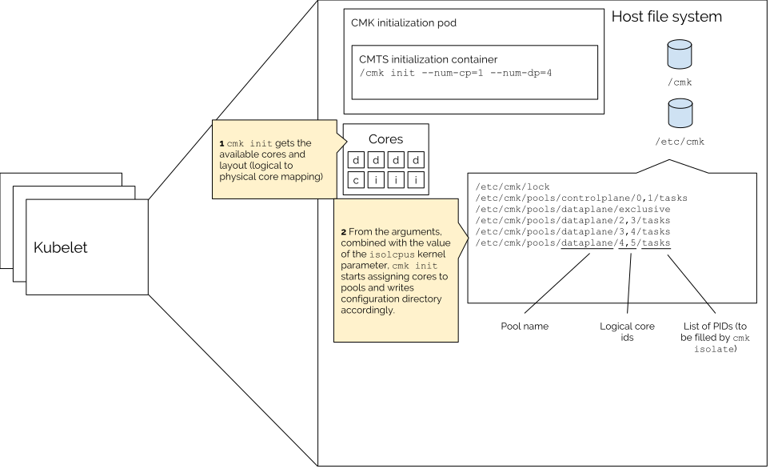
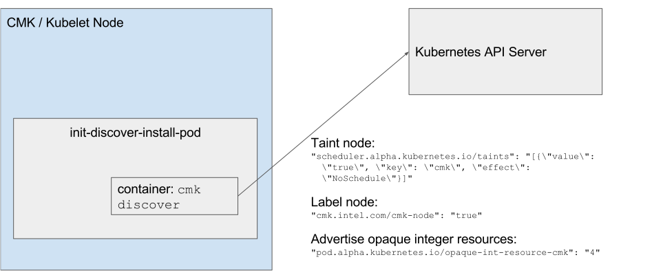
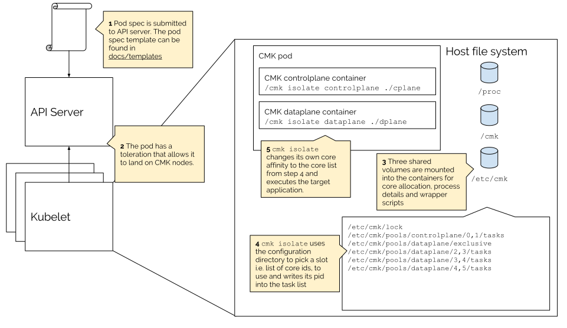

# Architecture: CPU Manager for Kubernetes

## Overview

CMK accomplishes core isolation by controlling what logical CPUs each
container may use for execution by wrapping target application commands
with the CMK command-line program. The `cmk` wrapper program maintains
state in a directory hierarchy on disk that describes **pools** from
which user containers can acquire available **CPU lists**. These pools
can be exclusive (only one container per CPU list) or non-exclusive
(multiple containers can share a CPU list.) Each CPU list directory
contains a `tasks` file that tracks process IDs of the container
subcommand(s) that acquired the CPU list. When the child process exits,
the `cmk` wrapper program clears its PID from the tasks file. If the
wrapper program is killed before it can perform this cleanup step, a
separate periodic reconciliation program detects this condition and cleans
the tasks file accordingly. A file system lock guards against conflicting
concurrent modifications.

The rest of this document discusses the high-level design of CMK.

For more information about the structure of state on disk, see
[The kcm configuration directory][doc-config].

For more information about how to use the `cmk` wrapper program, see
[Using the kcm command-line tool][doc-cli].

For more information about how to configure your cluster for CMK, see the
[Operator manual][doc-operator].

For more information about how to run your workload on a Kubernetes
cluster already configured for CMK, see the
[User manual][doc-user].

## Assumptions

1. The workload is a medium- to long-lived process with inter-arrival
   times on the order of ones to tens of seconds or greater.

1. After a workload has started executing, there is no need to
   dynamically update its CPU assignments.

1. Machines running workloads explicitly isolated by `cmk` must be guarded
   against other workloads that _do not_ consult the `cmk` tool chain.
   The recommended way to do this is for the operator to taint the node.
   The provided cluster-init subcommand automatically adds such a taint.

1. CMK does not need to perform additional tuning with respect to IRQ
   affinity, CFS settings or process scheduling classes.

1. The preferred mode of deploying additional infrastructure components
   is to run them in containers on top of Kubernetes.

## Requirements

1. Provide exclusive access to one or more physical cores for a given
   user containers.

1. Provide shared access to pools of physical cores for groups of
   user containers.

1. Provide a form of cooperative thread-level CPU affinity: allow some
   of a container's threads to run in the infrasctructure pool while
   other high priority threads (e.g. userspace poll-mode driver) run on
   exclusively allocated cores.

1. Run on unmodified Kubernetes releases.  
   **Supported Kubernetes versions:** v1.5.x, v1.6.x

1. Allow the `cmk` tools to be mounted from the host filesystem
   so that users do not need to include the tools inside every user
   container.

1. Interoperate well with the `isolcpus` kernel parameter. When
   initializing the CMK configuration directory, prefer to align
   dataplane CPU lists with fully-isolated physical cores.

1. Provide sufficient observability tooling to quickly assess the
   current configuration and health status of the CMK system.

## High level processes

### Initialization

### Discovery

### Isolation

### Monitoring

Please refer to the [`cmk node-report` documentation][cmk-node-report].

### Reconciliation

Please refer to the [`cmk reconcile` documentation][cmk-reconcile].

## Known issues

| Issue                      | Description                                    |
| :------------------------- | :--------------------------------------------- |
| Potential race between scheduler and pool state. | If a pod that consumes an exclusive opaque integer resource crashes in a way that prevents the `isolate` launcher from releasing the assigned cores, then although the OIR becomes available, the next invocation of `isolate` may not be able to safely make an allocation. This could occur for a number of reasons, most likely among them are: child process fails to terminate within the allowed grace period after receiving the TERM signal (Kubelet follows up with KILL) or receiving KILL from the kernel OOM (out-of-memory) killer. In this case, `isolate` must crash with a nonzero exit status. This will appear to the operator as a failed pod launch, and the scheduler will try to reschedule the pod. This condition will persist on that node until `reconcile` runs, at which point it will observe that the container's PID is invalid and free the cores for reuse by updating the `tasks` file. |
| Potential conflict with kernel PID reuse. | This should be extremely rare in practice, but it relates to the above scenario. If a PID of a `cmk` subcommand leaks as described above and is recycled by the kernel before `reconcile` runs, then when `reconcile` does run, it will see that the PID refers to a running process and will not remove that PID from the `tasks` file. There is currently no mitigation in place to protect against this scenario. |
| CMK `init` flag values for `--num-cp-cores` and `--num-dp-cores` must be positive integers. | Zero is unsupported by the tool chain. |
| The flag values for `--interval` (used in `cmk reconcile` and `cmk node-report`) must be integers. | Fractional seconds are not supported by the tool chain. |

[cmk-node-report]: cli.md#cmk-node-report
[cmk-reconcile]: cli.md#cmk-reconcile
[doc-config]: config.md
[doc-cli]: cli.md
[doc-operator]: operator.md
[doc-user]: user.md
