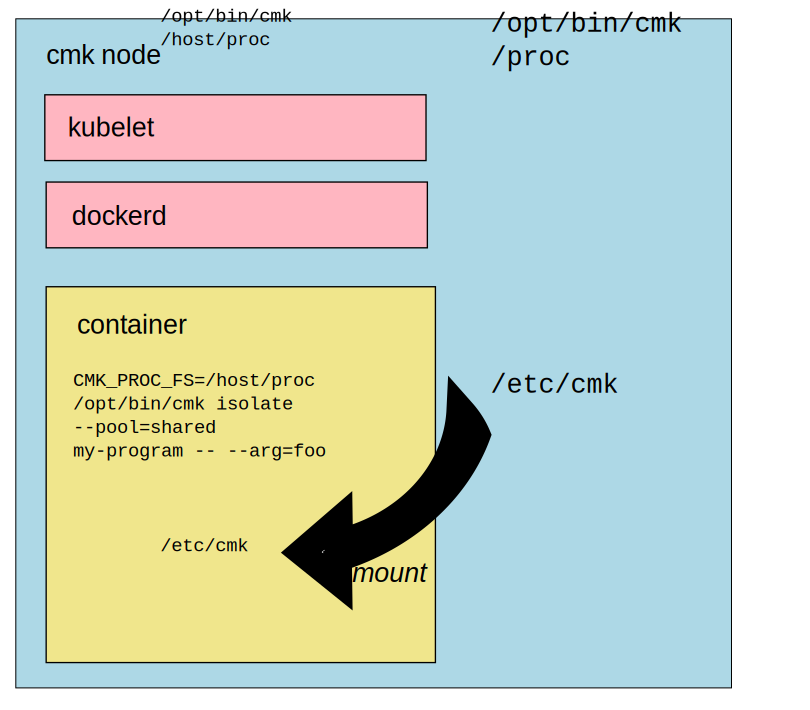

<!--
Intel License for KCM (version January 2017)

Copyright (c) 2017 Intel Corporation.

Use.  You may use the software (the “Software”), without modification, provided
the following conditions are met:

* Neither the name of Intel nor the names of its suppliers may be used to
  endorse or promote products derived from this Software without specific
  prior written permission.
* No reverse engineering, decompilation, or disassembly of this Software
  is permitted.

Limited patent license.  Intel grants you a world-wide, royalty-free,
non-exclusive license under patents it now or hereafter owns or controls to
make, have made, use, import, offer to sell and sell (“Utilize”) this Software,
but solely to the extent that any such patent is necessary to Utilize the
Software alone. The patent license shall not apply to any combinations which
include this software.  No hardware per se is licensed hereunder.

Third party and other Intel programs.  “Third Party Programs” are the files
listed in the “third-party-programs.txt” text file that is included with the
Software and may include Intel programs under separate license terms. Third
Party Programs, even if included with the distribution of the Materials, are
governed by separate license terms and those license terms solely govern your
use of those programs.

DISCLAIMER.  THIS SOFTWARE IS PROVIDED "AS IS" AND ANY EXPRESS OR IMPLIED
WARRANTIES, INCLUDING, BUT NOT LIMITED TO, THE IMPLIED WARRANTIES OF
MERCHANTABILITY, FITNESS FOR A PARTICULAR PURPOSE, AND NON-INFRINGEMENT ARE
DISCLAIMED. THIS SOFTWARE IS NOT INTENDED NOR AUTHORIZED FOR USE IN SYSTEMS OR
APPLICATIONS WHERE FAILURE OF THE SOFTWARE MAY CAUSE PERSONAL INJURY OR DEATH.

LIMITATION OF LIABILITY. IN NO EVENT WILL INTEL BE LIABLE FOR ANY DIRECT,
INDIRECT, INCIDENTAL, SPECIAL, EXEMPLARY, OR CONSEQUENTIAL DAMAGES (INCLUDING,
BUT NOT LIMITED TO, PROCUREMENT OF SUBSTITUTE GOODS OR SERVICES; LOSS OF USE,
DATA, OR PROFITS; OR BUSINESS INTERRUPTION) HOWEVER CAUSED AND ON ANY THEORY OF
LIABILITY, WHETHER IN CONTRACT, STRICT LIABILITY, OR TORT (INCLUDING NEGLIGENCE
OR OTHERWISE) ARISING IN ANY WAY OUT OF THE USE OF THIS SOFTWARE, EVEN IF
ADVISED OF THE POSSIBILITY OF SUCH DAMAGE. YOU AGREE TO INDEMNIFIY AND HOLD
INTEL HARMLESS AGAINST ANY CLAIMS AND EXPENSES RESULTING FROM YOUR USE OR
UNAUTHORIZED USE OF THE SOFTWARE.

No support.  Intel may make changes to the Software, at any time without
notice, and is not obligated to support, update or provide training for the
Software.

Termination. Intel may terminate your right to use the Software in the event of
your breach of this Agreement and you fail to cure the breach within a
reasonable period of time.

Feedback.  Should you provide Intel with comments, modifications, corrections,
enhancements or other input (“Feedback”) related to the Software Intel will be
free to use, disclose, reproduce, license or otherwise distribute or exploit
the Feedback in its sole discretion without any obligations or restrictions of
any kind, including without limitation, intellectual property rights or
licensing obligations.

Compliance with laws.  You agree to comply with all relevant laws and
regulations governing your use, transfer, import or export (or prohibition
thereof) of the Software.

Governing law.  All disputes will be governed by the laws of the United States
of America and the State of Delaware without reference to conflict of law
principles and subject to the exclusive jurisdiction of the state or federal
courts sitting in the State of Delaware, and each party agrees that it submits
to the personal jurisdiction and venue of those courts and waives any
objections. The United Nations Convention on Contracts for the International
Sale of Goods (1980) is specifically excluded and will not apply to the
Software.
-->

# `kcm` user manual

This doc is for application owners who need to deploy containers with
core affinity requirements on Kubernetes.

Here we assume that the cluster is already properly configured. For
information on how to set up the cluster with `kcm` enabled, see the
[`kcm` operator manual][doc-operator].

## Pod configuration

The only KCM CLI subcommand users (pod authors) need to know about is
[kcm isolate][kcm-isolate]. The `isolate` subcommand consults shared state
on the host file system to acquire and bookkeep an assigned subset of CPUs
a command should run on.

**ALERT:** It's easy to accidentally break out of `kcm isolate` with a malformed
shell command in user pod specs. For example:
`kcm isolate echo foo && sleep 100` isolates _only the execution of `echo`_!
The assigned CPUs are wrongly freed early when `kcm` returns. To avoid this
situation, avoid forking in the shell command, or alternately isolate a shell
and wrap your complex command:
`kcm isolate --pool=<pool> /bin/bash -- -c "foo && bar || baz"`

The figure illustrates a few important points:

- The [KCM configuration directory][doc-config] must be mounted into the
  container at a path that matches the value of `--config-dir`.
- The host [procfs][procfs] must be mounted into the container at a path that matches
  the value of the `KCM_PROC_FS` environment variable. Since bind-mounting
  over the top of the procfs at `/proc` from inside the pid namespace would
  cause problems, we mount it at `/host/proc` in the examples throughout these
  docs.
- The operator guide recommends providing the `kcm` binary on the host
  filesystem so it can be mounted and used from user containers without forcing
  them to build `kcm` into their images. By default these docs assume the
  binary is available on the host filesystem at `/opt/bin/kcm`.

For a complete example, see the [kcm isolate pod template][isolate-template].

[doc-config]: config.md
[doc-operator]: operator.md
[isolate-template]: ../resources/pods/kcm-isolate-pod.yaml
[kcm-isolate]: cli.md#kcm-isolate
[procfs]: http://man7.org/linux/man-pages/man5/proc.5.html
